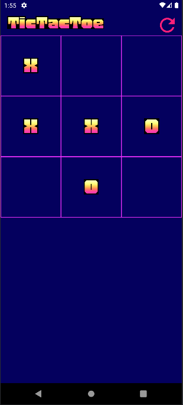
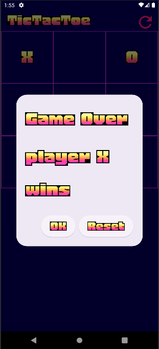

TicTacToe Flutter App
This is a simple TicTacToe game implemented in Flutter. The game allows two players to take turns marking cells on a 3x3 grid, with the objective of getting three of their marks in a row, column, or diagonal.

Features
Two-player gameplay
Win detection for rows, columns, and diagonals
Draw detection
Reset game option
How to Play
Open the app on your device.
Players take turns tapping on an empty cell to mark it with their symbol (X or O).
The first player to get three of their symbols in a row, column, or diagonal wins.
If all cells are filled and no player has won, the game ends in a draw.
Screenshots

Dependencies
Flutter SDK
Material Design widgets for Flutter
Getting Started
To run the app locally, follow these steps:

Clone this repository.
Navigate to the project directory.
Run flutter pub get to install dependencies.
Connect a device or emulator and run flutter run.
Contributions
Contributions to improve the app are welcome! If you have any suggestions, bug fixes, or feature requests, please feel free to submit a pull request or open an issue.

Credits
This app was created by rojanUN.